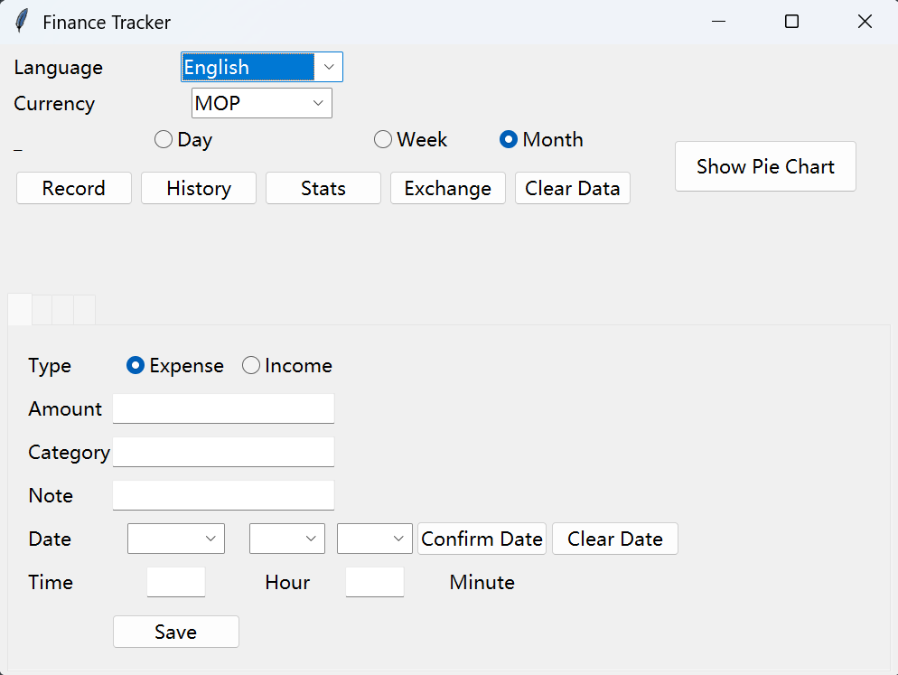

# 1. Graphical Abstract

---

# 2. Project Purpose
This project is a desktop personal finance tracking application developed with Python and Tkinter. It helps users manage daily income and expenses, view history, generate statistical charts, support multi-currency and multi-language, and export data.

### Software Development Process Applied
Agile

### Reason for Choosing Agile
- Small-scale individual project with frequent function adjustments
- Incremental development and fast iteration
- Convenient for testing and modifying functions one by one
- Suitable for personal development mode

### Target Users
- Students
- Office workers
- Personal finance managers
- Users in Macao (supports MOP, CNY, HKD)

---

# 3. Software Development Plan
### Development Process
1. Requirement analysis
2. UI interface design
3. Income and expense record function
4. History management (view, filter, delete)
5. Statistical analysis and pie chart
6. Multi-language support (Chinese, English, Korean)
7. Multi-currency and real-time exchange rate
8. CSV import and export
9. Data clearing function
10. System testing and optimization

### Member Information
- Name:YANGHAOHAN
- Student ID: P2422946
- Role: Full-stack developer, Tester, Document writer
- Contribution: 100%

### Schedule
- Week 1: Project design and basic UI
- Week 2: Core record function and CSV storage
- Week 3: History page and data operations
- Week 4: Statistics, chart and exchange rate
- Week 5: Multi-language, testing and video demo

### Core Algorithm & Logic
- Data persistence: CSV file
- Currency conversion: API + offline backup
- Chart: Matplotlib
- Date filtering: datetime module
- Interface: Tkinter

### Current Status
All functions completed and run stably.

### Future Plan
- User login and data encryption
- Cloud data synchronization
- Mobile application version
- More categories and budget reminders

---

# 4. Demo Video
OneDrive URL: https://1drv.ms/v/c/74D85372BB209E0D/IQBQJ-PuDonTT6waG0gSKPPwAeHCIvDLIystIjYJJRWtKvs?e=THzNas

---

# 5. Development & Runtime Environment
- Programming Language: Python 3.8+
- Operating System: Windows / macOS
- Required Libraries:
  - tkinter
  - csv
  - datetime
  - requests
  - matplotlib
  - ctypes

### Installation Command
pip install requests matplotlib

### Run Command
python main.py

---

# 6. Declaration of Third-Party Resources
This project uses the following third-party tools and APIs for education only:
- Tkinter (Python built-in UI library)
- Matplotlib (chart drawing)
- Requests (network request)
- Exchange rate API: https://api.exchangerate-api.com
- CSV for local data storage

All resources are free and open for educational use.

---

# 7. Main Functions
- Record income and expenses
- View, sort, filter, delete history
- Pie chart statistics (day / week / month)
- Multi-language: Chinese, English, Korean
- Multi-currency: MOP, CNY, HKD
- Real-time exchange rate calculation
- Export CSV file
- Clear data by range or all

---

# 8. User Guide
1. Run main.py to start the application
2. Select language and currency
3. Use “Record” to add income/expense
4. Use “History” to view and manage records
5. Use “Stats” to view summary
6. Click “Show Pie Chart” to view category ratio
7. Use “Exchange” for currency conversion
8. Export or clear data as needed